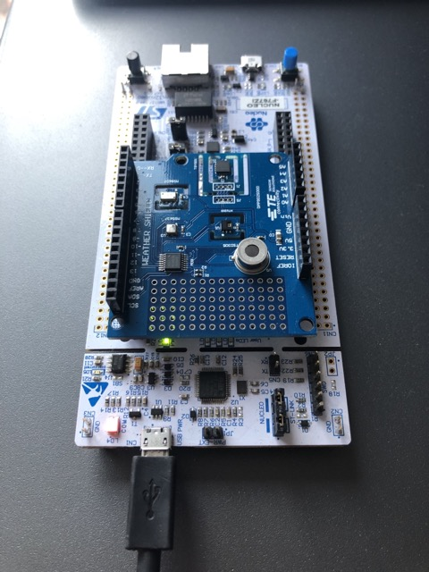

# stm32-ucos

## Overview

Inspired by [stm32-makefile](https://github.com/bbrown1867/stm32-makefile), this repository is an example project demonstrating how to use an STM32 microcontroller with uCOS-III. The project runs on the Nucleo-144 development board targeting the STM32F767ZI microcontroller with the [TE Connectivity Weather Shield](https://www.te.com/usa-en/product-CAT-DCS0026.html) attached. The project uses:

* CMake (Build System)
* GNU ARM Embedded Toolchain (Compiler)
* STM32CubeF7 MCU Firmware Package (BSP/Drivers)
* uCOS-III, uC-CPU, uC-Lib (RTOS)
* OpenOCD (Debug)



## Motivation

This project was created while reading _uCOS-III The Real-Time Kernel_ (STM32 version, 2009). There are example projects associated with this book, but building up an  application from scratch is a useful to understand...

* Which files are kernel code vs. user code.
  * _Clear separation is done using Git submodules._
* What kernel APIs must be called and which ones are optional based on the application requirements.
  * _The code is thoroughly commented with book references._

## Design

Currently there are 3 tasks:

* __`app_task`__: This task doesn't do much except creating other tasks and then toggling an LED every 1 second. In a larger system, this task might have more responsibility like centralized error handling.
* __`logger_task`__: Example of a logger that leverages uCOS features. Since we don't want multiple tasks competing for a stateful hardware resource, `logger_task` is the exclusive owner of `bsp_uart.c`. Other tasks log to the serial console by sending this task a message. A memory pool is used such that other tasks don't need to worry about potentially overwriting buffers and can move on right after calling the logger APIs.
* __`sensor_task`__: Since `logger_task` is a "consumer", this project would be boring without an interesting "producer". Since the Nucleo-144 doesn't have any sensors on it, the TE Connectivity
Weather Shield is used. This shield has 5 environmental sensors that read some combination of temperature, pressure, and humidity. The task is designed to be generic should that multiple instances of it could be created for each sensor.

The BSP modules are also designed to leverage uCOS features:

* __`bsp_led.c` and `bsp_sensor.c`__: These drivers protect all API calls (except initialization) with a mutex. This allows them to be used by multiple tasks safely. This pattern works when hardware access is quick and not stateful, like LED toggling and small I2C transactions.
* __`bsp_uart.c`__: As mentioned above, this driver is not protected with a mutex since it is owned by a single task. However a semaphore is used to synchronize the UART transmit API call with the interrupt service routine (ISR). This allows uCOS to perform a context switch during a UART transmit if necessary since the transmit processing will be done from the interrupt handler.

### Future Improvements

* Dig deeper into the MS8607 sensor settings, as the current use is very simple and minimal.
  * May need some calibration to get more accurate results.
* Support more Weather Shield sensors by adding them to `bsp_sensor.c`. Create multiple instances of `sensor_task` for each of them, passing in `Sensor_TypeDef` as an input to the task.
  * This requires making the task data (TCB, stack) arrays that are indexed with the `Sensor_TypeDef` task input argument.
* Switch to "dynamic tick" to save power.
  * This requires programming a one-shot timer to avoid waking up unnecessarily every tick.
* Enter low-power mode during the idle task to save power.
* Use DMA in `bsp_uart.c`, to minimize the number of interrupts during a transmit.
* Integrate a tool or build something to visualize context switches. Also try to use the uCOS statistics task.

## User Guide

### Setup

This project uses roughly the same tooling as [stm32-makefile](https://github.com/bbrown1867/stm32-makefile), so please see that project for installation advice. The only new dependency is `cmake`, which can be easily installed with system package managers like `brew install cmake` on macOS. The submodules can be downloaded with `git submodule init && git submodule update`. It is assumed that `arm-none-eabi-gcc` is in the system path.

Some other helpful tools are used in the Makefile:

* `astyle`: Enforce language specific coding conventions. Install with `brew install astyle`.
* `pyserial`: Used for serial console (logger output). Install with `pip3 install pyserial`.

### Build and Run

* Simply run `make` to build the project.
* In another terminal, start the GDB server by running `make gdb-server`.
* In another terminal, view the logs using `make serial-console`.
* Run `make gdb-client` to download the code and start debugging.

If everything is working, the logs on the serial console should look like:

```console
[0][Application Task] App Task Heartbeat
[170][Sensor Task] Temperature: 27.040001
[170][Sensor Task] Humidity: 36.201996
[170][Sensor Task] Pressure: 997.739990
[170][Sensor Task] Number of Sensor Readings = 1
[1000][Application Task] App Task Heartbeat
[1222][Sensor Task] Temperature: 27.040001
[1222][Sensor Task] Humidity: 36.209625
[1222][Sensor Task] Pressure: 997.710022
[1222][Sensor Task] Number of Sensor Readings = 2
[2000][Application Task] App Task Heartbeat
[2274][Sensor Task] Temperature: 27.040001
[2274][Sensor Task] Humidity: 36.194366
[2274][Sensor Task] Pressure: 997.710022
[2274][Sensor Task] Number of Sensor Readings = 3
```

## Notes

### Resources

* [uCOS-III API Reference](https://micrium.atlassian.net/wiki/spaces/osiiidoc/pages/132271/uC-OS-III+API+Reference)

### ISR Template

```cpp
CPU_SR_ALLOC();

CPU_CRITICAL_ENTER();
OSIntEnter();
CPU_CRITICAL_EXIT();

// Handle interrupt, clear pending bits

OSIntExit();
```

### Coding Style

* Lots of whitespace and comments for readability.
* Language specific style (braces, spacing, etc) is enforced using `astyle`.
* Templated uCOS code is unchanged ([Cfg](Cfg/), [os_app_hooks](Source/os_app_hooks/)) from the uCOS coding style.
* For readability and to match the book, uCOS API arguments are placed on individual lines with (sometimes unnecessary) type casts.
* Task-level code ([Source](Source/)):
  * APIs will pass error info to caller using a pointer as the final argument to match uCOS API style.
  * Naming:
    * Globals: `UpperCamelCase`.
    * Locals: `lower_snake_case`.
    * Functions: `lower_snake_case`.
* BSP-level code ([BSP](BSP/)):
  * APIs will pass error info to caller using the return value.
  * Naming: Copy STM32 HAL and uCOS style.
* Includes:
  * Ordering:
    * Relative header for current C file (if applicable).
    * Project includes.
    * Project library includes (BSP, uCOS, STM32 HAL).
    * Standard library includes.
  * Every file (source or header) should only include files needed by that individual file.
    * Do not make assumptions based on include ordering or lazily use includes from other headers.
  * Application should only access hardware through the BSP.
    * `bsp.h` will be the only include file used by applications to use hardware functionality.
